# Architecture Overview

## System Architecture Diagram

```mermaid
graph TB
    %% External Tools
    Claude[🤖 Claude Code]
    LMStudio[🏠 LM Studio]
    Docs[📁 Documents Directory<br/>~/Documents]
    
    %% Host Services
    Ollama[🦙 Ollama<br/>Host:11434<br/>- mxbai-embed-large<br/>- llama3.1:8b]
    
    %% Containerized Services
    subgraph "Docker Services"
        ChromaDB[🗃️ ChromaDB<br/>:8000<br/>Vector Database]
        Processor[⚙️ Processor<br/>:8001<br/>Document Processing<br/>& Search API]
        MCPServer[🔌 MCP Server<br/>:8002<br/>Model Context Protocol]
        ChatUI[💬 Chat Interface<br/>:8003<br/>Web UI]
    end
    
    %% Document Processing Flow
    Docs -->|File Watching<br/>& Processing| Processor
    Processor -->|Text Extraction<br/>via Unstructured| Processor
    Processor -->|Generate Embeddings| Ollama
    Processor -->|Store Vectors| ChromaDB
    
    %% MCP Integration Flow
    Claude -.->|MCP Protocol| MCPServer
    LMStudio -.->|MCP Protocol| MCPServer
    MCPServer -->|Search Queries| Processor
    Processor -->|Vector Search| ChromaDB
    ChromaDB -->|Results| Processor
    Processor -->|Context| MCPServer
    MCPServer -.->|Augmented Context| Claude
    MCPServer -.->|Augmented Context| LMStudio
    
    %% Chat Interface Flow
    ChatUI -->|User Query| Processor
    Processor -->|Document Search| ChromaDB
    Processor -->|LLM Generation| Ollama
    Ollama -->|Response| ChatUI
    
    %% API Connections
    Processor -.->|REST API| Ollama
    MCPServer -.->|Docker Exec| MCPServer
    
    %% Styling
    classDef external fill:#e1f5fe,stroke:#01579b,stroke-width:2px
    classDef host fill:#f3e5f5,stroke:#4a148c,stroke-width:2px
    classDef container fill:#e8f5e8,stroke:#1b5e20,stroke-width:2px
    classDef database fill:#fff3e0,stroke:#e65100,stroke-width:2px
    
    class Claude,LMStudio,Docs external
    class Ollama host
    class Processor,MCPServer,ChatUI container
    class ChromaDB database
```

## Component Details

### External Components
- **Claude Code**: Anthropic's AI assistant with MCP integration for document search
- **LM Studio**: Local LLM interface with MCP support for RAG capabilities  
- **Documents Directory**: Your local file system containing documents to be indexed

### Host Services
- **Ollama**: Runs natively on host for GPU access
  - `mxbai-embed-large`: Embedding model for document vectorization
  - `llama3.1:8b`: Chat model for the web interface

### Containerized Services
- **ChromaDB**: Vector database storing document embeddings
- **Processor**: Core service handling document processing, embedding generation, and search
- **MCP Server**: Provides Model Context Protocol interface for external tool integration
- **Chat Interface**: Web-based UI for direct interaction with your documents

## Data Flow Patterns

### Document Ingestion
1. **File Watching**: Processor monitors documents directory for changes
2. **Text Extraction**: Unstructured library processes various file formats
3. **Chunking**: Documents split into semantic chunks
4. **Embedding**: Ollama generates vector embeddings
5. **Storage**: Vectors stored in ChromaDB with metadata

### MCP Query Flow  
1. **External Query**: Claude Code or LM Studio sends search request via MCP
2. **Vector Search**: MCP Server forwards query to Processor
3. **Retrieval**: ChromaDB returns relevant document chunks
4. **Context**: Results sent back to external tool for RAG completion

### Chat Interface Flow
1. **User Input**: Web interface receives natural language query
2. **Document Search**: Processor searches ChromaDB for relevant context
3. **LLM Generation**: Ollama generates response using found context
4. **Streaming Response**: Real-time response delivery to web UI

## Network Architecture

### Linux Host Networking
- Processor, MCP Server, and Chat Interface use host networking on Linux
- Bypasses Docker networking issues with Ollama connectivity
- Ports 8001, 8002, 8003 exposed directly on host

### macOS Bridge Networking
- Standard Docker bridge networking works reliably
- Services communicate via `host.docker.internal`

## Security Considerations

### MCP Integration
- ⚠️ **External Access**: MCP enables Claude Code to access your local documents
- ⚠️ **Network Exposure**: Host networking on Linux exposes ports to local network
- ✅ **Local Processing**: All LLM processing remains on your machine via Ollama

### Isolation Levels
- **ChromaDB**: Isolated in Docker bridge network
- **Ollama**: Runs on host with configurable network binding
- **MCP Services**: Host networking on Linux, bridge on macOS